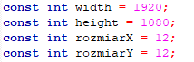

# Game of Life written in C++ SFML
Customizable game of life made for learning purposes.
<h3>How to customize</h3>

Four variables which you can customize to your own choice. First two width and height are for resolution (how many pixels to work with).
Next two rozmiarX and rozmiarY are for X (width) and Y (height) of each cell. 

After running program you can set some variables.
First one tells how many cells you want to randomize. 
Next to are connected with game of life behavior. You can customize living and dead rules. You pass numbers without space, one by one.
Example for standard game of life is:
23 
3
<h3> Showcase </h3>

Living rule: 23 Dead rule: 3 Block size: 12 x 12

Living rule: 23 Dead rule: 3 Block size: 6 x 6

Living rule: 12345 Dead rule: 3 Block size: 12 x 12

Living rule: 4567 Dead rule: 345 Block size: 12 x 12

